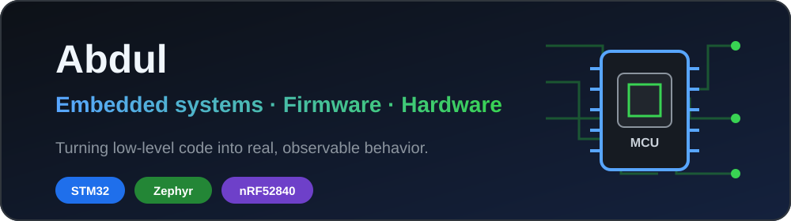
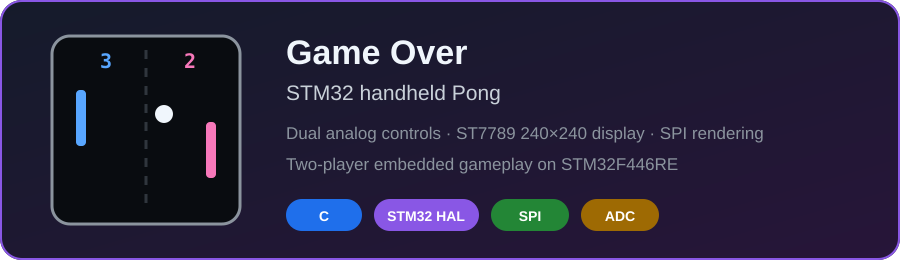
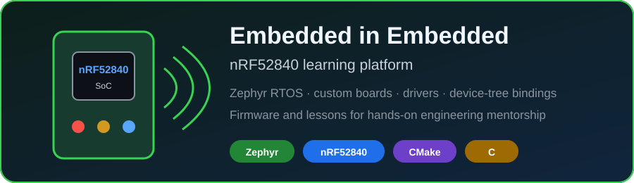
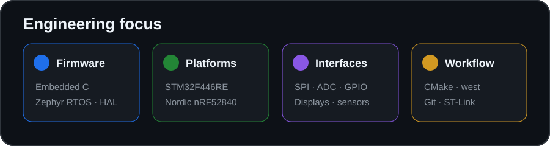

<div align="center">



# Hi, I'm Abdul 👋

### Embedded systems · Firmware · Hardware-software integration

I build hands-on embedded projects around microcontrollers, real-time firmware,
custom hardware, displays, sensors, and the tooling that makes them work together.

</div>

---

## 🔧 What I work on

- **Embedded firmware** for Nordic Semiconductor and STM32 microcontrollers
- **Zephyr RTOS** applications, custom boards, drivers, and device-tree bindings
- **Interactive hardware** using displays, joysticks, sensors, SPI, ADC, and GPIO
- **Engineering education** through practical embedded-systems lessons and examples
- **Prototype-to-product workflows** using CMake, west, STM32CubeIDE, and Git

## 🧰 Tools and technologies

`C` · `Python` · `Zephyr RTOS` · `STM32` · `Nordic nRF52840` · `CMake` · `west` · `Git`

---

## 🚀 Featured projects

### 🎮 Game Over — STM32 handheld Pong

An embedded Pong game for the **STM32F446RE**, derived from custom controller
hardware. Two analog joystick axes control independent paddles, while an
**ST7789 240×240 display** is driven over SPI.

**Highlights:** dual ADC input · SPI display rendering · STM32 HAL · embedded C ·
two-player gameplay · STM32CubeIDE/ST-Link workflow

<div align="center">
  <a href="https://github.com/AbdulWQ/Game-Over">
    
  </a>
</div>

### 📡 Embedded in Embedded — nRF52840

Firmware and learning material for the University of Calgary's
**Embedded in Embedded** mentoring program. The project is built around the
Nordic **nRF52840 development kit** and **Zephyr RTOS**, with examples spanning
custom boards, drivers, device-tree bindings, libraries, and lessons.

**Highlights:** Zephyr RTOS · nRF52840 · custom board definitions · GPIO drivers ·
sensor drivers · CMake/west tooling · hands-on documentation

<div align="center">
  <a href="https://github.com/AbdulWQ/eie_nrf52840">
    
  </a>
</div>

---

## 📊 Engineering at a glance



---

## 🧭 Current direction

```text
Build the hardware → write the firmware → test the system → document the result
```

I'm continuing to explore embedded development through practical projects that
connect low-level software with real, observable hardware behavior.

<div align="center">

### Thanks for visiting

Explore the repositories below to see the implementation details.

</div>
