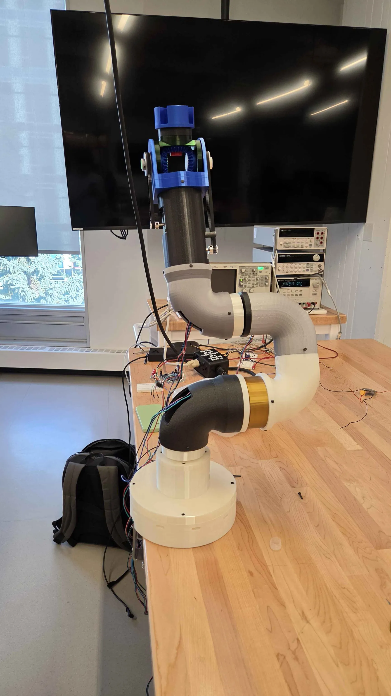
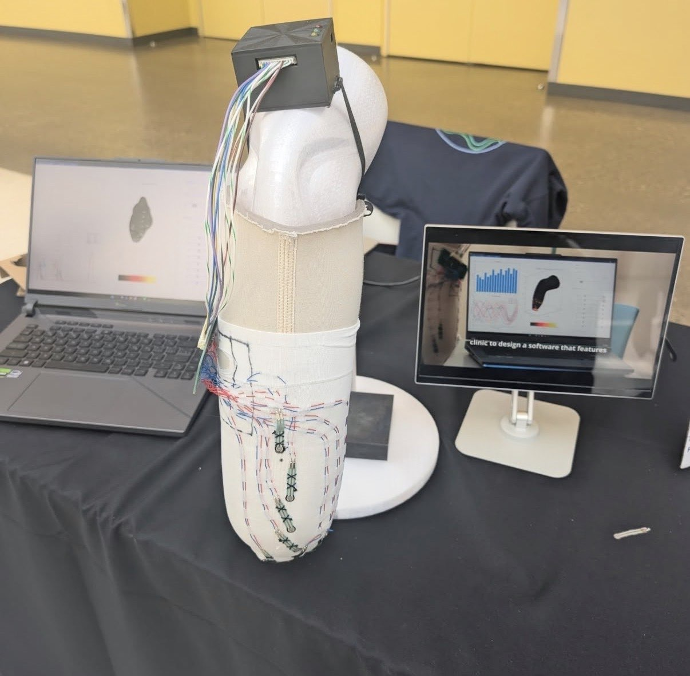
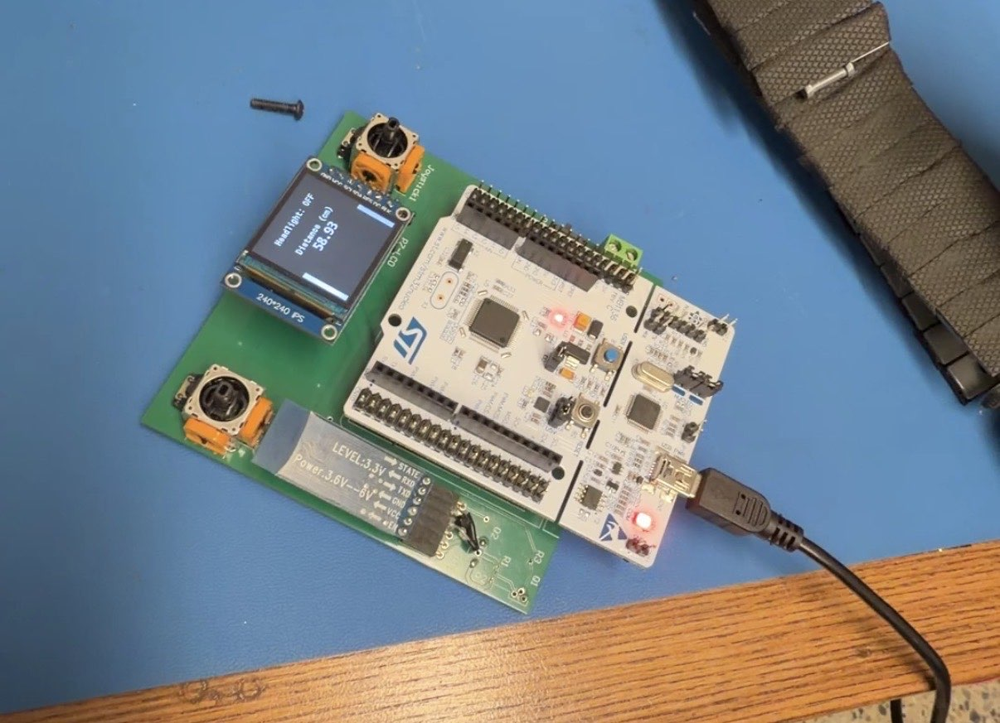
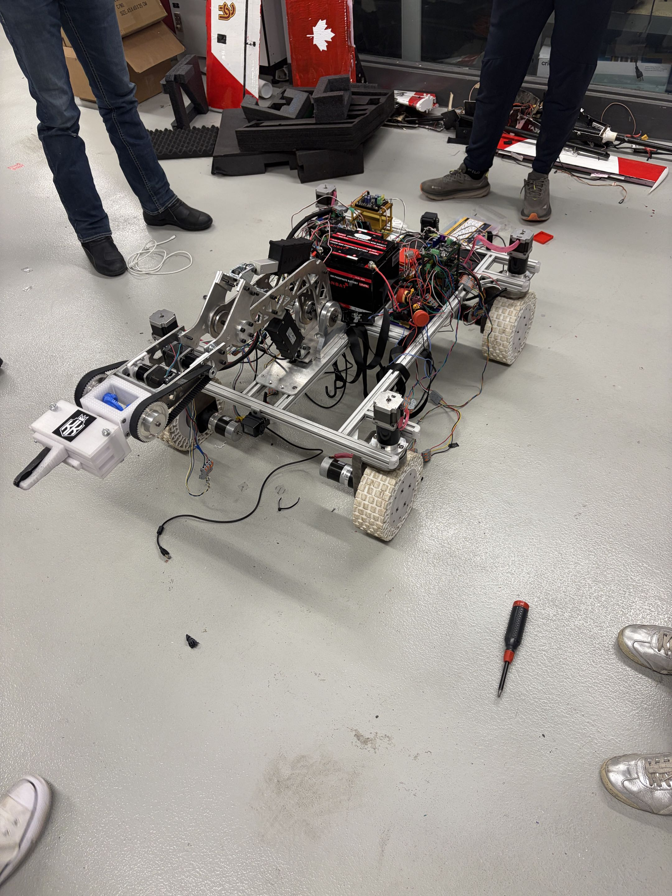

# Abdul Wahab

Embedded systems, firmware, and hardware development.

I work with STM32 and Nordic microcontrollers, Zephyr RTOS, sensors, displays,
custom electronics, and electromechanical systems.

## Selected work

### WayBionic

Development of a robotic arm covering mechanical prototyping, joint actuation,
motor control, CAN communication, power distribution, and controller hardware.

  

### Prosthetic Sensor Sock

A pressure-sensing prosthetic interface developed through sensor characterization,
textile integration, multiplexed acquisition electronics, custom PCBs, and live
pressure visualization.

  

### [Game Over](https://github.com/AbdulWQ/Game-Over)

An STM32F446RE handheld game system with analog controls and an SPI display.
The repository documents the hardware and embedded Pong implementation.

  

### Space Rover

A mobile robotics platform integrating mechanical systems, drive electronics,
sensors, control hardware, and a custom manipulator.

  

### [Embedded in Embedded](https://github.com/AbdulWQ/eie_nrf52840)

Firmware and instructional material for the University of Calgary's Embedded in
Embedded mentoring program, built around the nRF52840 and Zephyr RTOS.

## Technical areas

`C` · `Python` · `STM32` · `nRF52840` · `Zephyr RTOS` · `SPI` · `ADC` · `CAN` · `CMake` · `west` · `Git`
